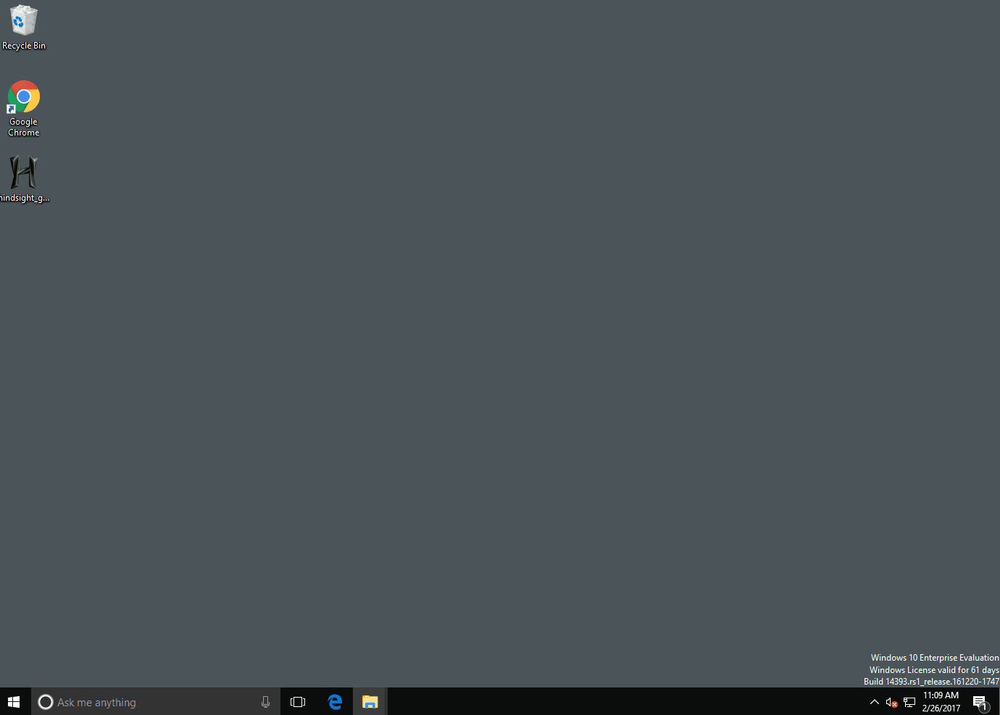

 Hindsight
=========

Internet history forensics for Google Chrome/Chromium

Hindsight is a free tool for analyzing web artifacts. It started with the browsing history of the Google Chrome web browser and has expanded to support other Chromium-based applications (with more to come!). Hindsight can parse a number of different types of web artifacts, including URLs, download history, cache records, bookmarks, autofill records, saved passwords, preferences, browser extensions, HTTP cookies, and Local Storage records (HTML5 cookies). Once the data is extracted from each file, it is correlated with data from other history files and placed in a timeline.

It has a simple web UI - to start it, run "hindsight_gui.py" (or on Windows, the packaged "hindsight_gui.exe") and visit http://localhost:8080 in a browser:  



The only field you are required to complete is "Profile Path". This is the location of the Chrome profile you want to analyze (the default profile paths for different OSes is listed at the bottom of this page). Click "Run" and you'll be taken to the results page in where you can save the results to a spreadsheet (or other formats). 

## Manual Installation

```sh
pip install pyhindsight
curl -sSL https://raw.githubusercontent.com/obsidianforensics/hindsight/master/install-js.sh | sh
```

## Command Line

There also is command line version of Hindsight - hindsight.py or hindsight.exe. The user guide in the documentation folder covers many topics, but the info below should get you started with the command line version:

Example usage:  \> C:\\hindsight.py -i "C:\Users\Ryan\AppData\Local\Google\Chrome\User Data\Default" -o test_case

Command Line Options:

| Option         | Description                                             |
| -------------- | ------------------------------------------------------- |
| -i or --input  | Path to the Chrome(ium) "Default" directory |
| -o or --output | Name of the output file (without extension) |
| -f or --format | Output format (default is XLSX, other options are SQLite and JSONL) |
| -c or --cache  | Path to the cache directory; only needed if the directory is outside the given "input" directory. Mac systems are setup this way by default. |
| -b or --browser_type | The type of browser the input files belong to. Supported options are Chrome (default) and Brave.
| -l or --log	 | Location Hindsight should log to (will append if exists) |
| -h or --help   | Shows these options and the default Chrome data locations |
| -t or --timezone | Display timezone for the timestamps in XLSX output |

## Default Profile Paths

The Chrome default profile folder default locations are:
* WinXP:   \[userdir\]\Local Settings\Application Data\Google\Chrome\User Data\Default
* Vista/7/8/10: \[userdir\]\AppData\Local\Google\Chrome\User Data\Default
* Linux:   \[userdir\]/.config/google-chrome/Default
* OS X:    \[userdir\]/Library/Application Support/Google/Chrome/Default
* iOS:   \Applications\com.google.chrome.ios\Library\Application Support\Google\Chrome\Default
* Android: /userdata/data/com.android.chrome/app_chrome/Default
* CrOS: \home\user\\<GUID\>

## Feature Requests

Please [file an issue](https://github.com/obsidianforensics/hindsight/issues/new/choose) if you have an idea for a new feature (or spotted something broken).
